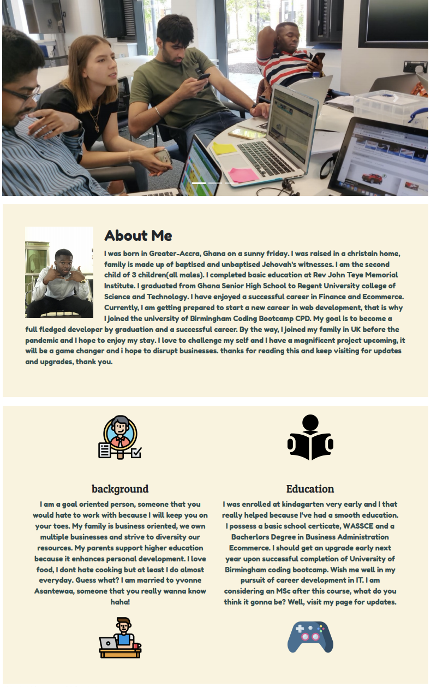
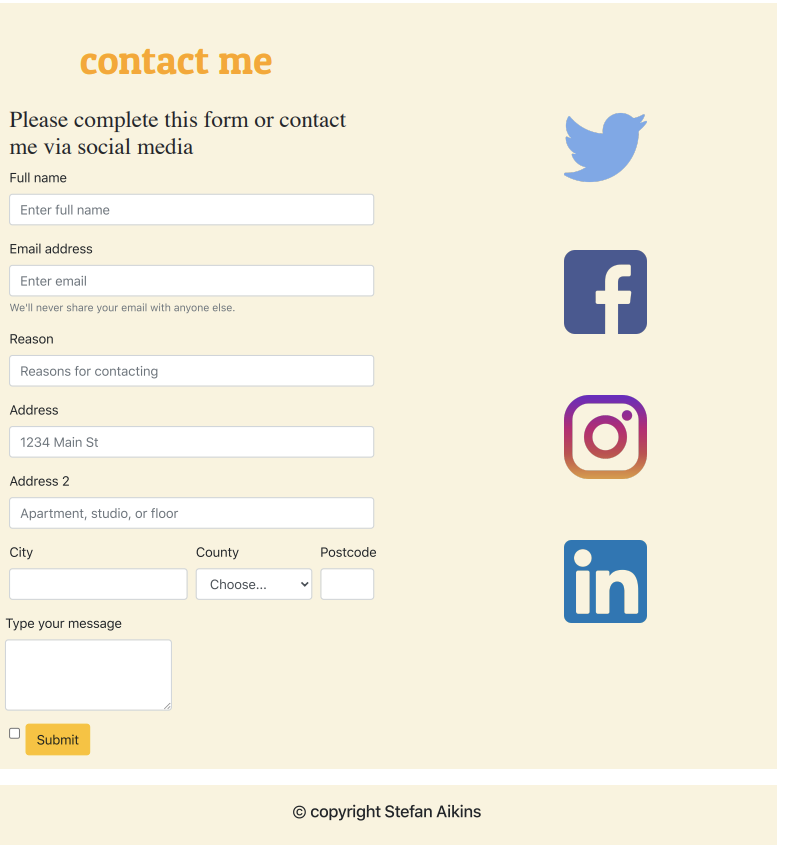
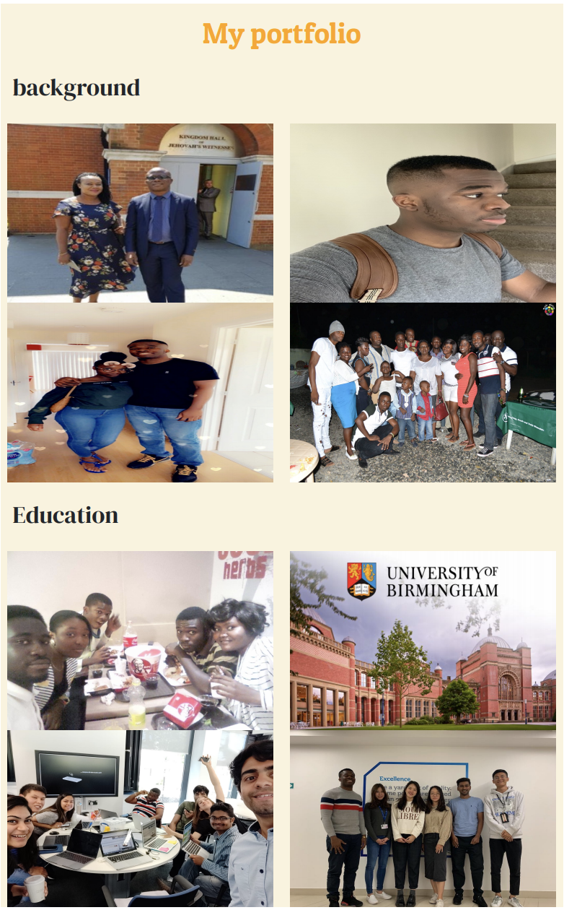

# responsive-portfolio
creating basic responsive design
* Consist of 3 pages; about me, contact and portfolio

Click here to visit my website: [My first responsive website](https://stefan-aikins.github.io/responsive-portfolio/)

## About me 

About me is the homepage, clicking the navigation(nav) logo reloads the web page. clicking the nav logo in the contact or portfolio pages takes the user to the home page.

## Usage
* Clicking about me on the nav menu loads the about me page, contact will take the user to my contact me page and portfolio will load my portfolio page.
* The slide show automatically cycles through images of my life memories and also communicates to the user about my life.
* Clicking the next and prevoius controls manually cycles through the images
* Scroll up and down this page to read about me, my bacground, education career and hobbies
* Clicking any social media icon will take you to the respective social media page.
* Browse my social media account to learn all you can about me

## Contact me
* Fill the form and submit your message.
* Alternatively, chat me live by clicking your preferred social media handle on the right hand side of the page.

## My Portfolio
* Simply scroll up and down the page to view pictures and memories about my past experiences in life, education, career and leisure.

## Credits
  * Responsive design and part of the styling is supported by Bootstrap Content Delivery Network [Bootstrap](https://getbootstrap.com/)
  * Font styling is supported by [Google fonts](https://fonts.google.com/)
  * icons were sourced from [flat icons](https://www.flaticon.com/)

## Future Developments
* Form will confirm submission
